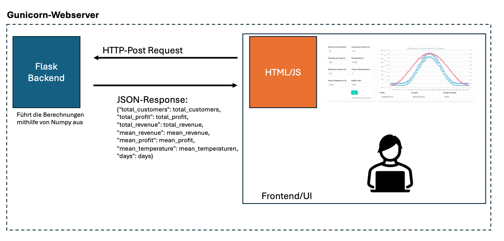

# Ice-Cream Business MC-Tool

## Run the Application using Python: 

### Install the Python Packages

```sh
pip install -r requirements.txt
```

### Run the App with Gunicorn:

```sh
gunicorn app:app -b 0.0.0.0:4000
```
or: 

```sh
python app.py
```

Open the **0.0.0.0:4000**

## Run the Application with Docker:

```sh
docker-compose up
```


## Architecture and Information Flow



Tom Bischopink © - HTWD 2024